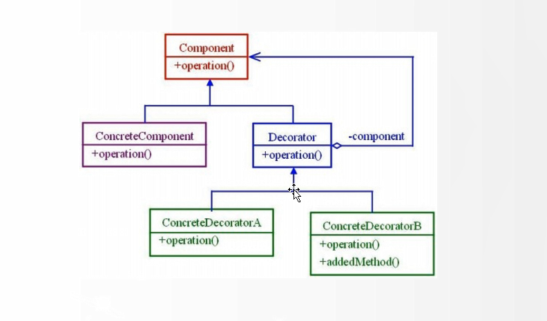

所谓io，是什么呢?
是相对于程序而言输入输出的意思，从硬盘、控制台、网络、内存等等获取数据为读 -- `i`，写入数据为输出 -- `0`
io在java中被抽象成 -- `流`,所谓流即为流动的意思,分为几种
- 字节流
数据是二进制的，byte 人工不可读，-- inputStream/outputStream
- 字符流
数据是字符char人工可读，reader/writer

## 字符流
```java
public class ReadMySelf {
    public static void main(String[] args) throws IOException {
        //读取一个文件的内容并且在控制台中输出
        BufferedReader bufferedReader = null;
        StringWriter stringWriter = new StringWriter();
        try {
            bufferedReader = new BufferedReader(new FileReader("src/main/java/io/ReadMySelf.java"));//本文件的路径
            String line = null;
            while ((line = bufferedReader.readLine()) != null) {
                stringWriter.write(line);
                stringWriter.write("\n");
            }
            System.out.println(stringWriter.toString());
        } catch (FileNotFoundException e) {
            e.printStackTrace();
        } catch (IOException e) {
            e.printStackTrace();
        } finally {
            bufferedReader.close();
        }
    }
}
```
关于读文件注意点:
```java
// 每次读10个字符的数据，需要判断文件结尾是否满足10个字符的要求。
// 如果最后一次读文件时数据不够10个字符，比如只有3、4个字符时，如果不限制读取会出问题。
char[] buffer = new char[10];
int length = -1;

while ((length = fileReader.read(buffer)) != -1) {
    if(length == 10) {
        System.out.print(buffer);
    } else{
        System.out.print(new String(buffer,0,length));
    }
}
```

## 字节流
```java
public class ReadMySelfByte {
    public static void main(String[] args) throws IOException {
        //使用字节流读写一个文件
        BufferedInputStream bufferedInputStream = null;
        BufferedOutputStream bufferedOutputStream = null;
        try{
            byte[] buffer = new byte[256];
            bufferedInputStream = new BufferedInputStream(new FileInputStream("src/main/java/io/byte.png"));
            bufferedOutputStream = new BufferedOutputStream(new FileOutputStream("src/main/java/io/byte_output.png"));

            int length = -1;
            int total = 0;
            while ((length = bufferedInputStream.read(buffer)) != -1) {
                //total += length;9
                bufferedOutputStream.write(buffer,0,length);
            }
            bufferedOutputStream.flush();//需要从缓存中写出来
            //System.out.println(total);
        } catch (IOException e) {
            e.printStackTrace();
        } finally {
            bufferedInputStream.close();
            bufferedOutputStream.close();
        }
    }
}
```

## RandomAccessFile
可以自由访问文件的任意位置，就是说可以获取文件任意内容 -- 随机访问文件
通过seek移动指针进行读取操作
```java
public class RandomFileIO {
    public static void main(String[] args) {
        try {
            RandomAccessFile file = new RandomAccessFile("src/main/java/io/readme.md","rw");

            //在flie中写入内容
            file.writeInt(20); //占四个字节
            file.writeDouble(7.3232); //占八个字节
            file.writeUTF("这是一个UTF的字符");
            file.writeBoolean(true); //占一个字节
            file.writeShort(322); //占两个字节
            file.writeLong(54546789);//占八个字节
            file.writeUTF("同上一个UTF字符");
            file.writeFloat(35.5f);//占四个字节
            file.writeChar('a');//占两个字节

            file.seek(0); //将文件指针位置放在起始处

            //开始读取file中的数据，注意指针位置
            System.out.println("--从file文件指定位置读取数据--");
            System.out.println(file.readInt());
            System.out.println(file.readDouble());
            System.out.println(file.readUTF());

            //
            file.skipBytes(3);
            System.out.println(file.readLong());

            System.out.println("--文件复制（从file到filecopy）--");
            file.seek(0);
            RandomAccessFile filecopy = new RandomAccessFile("src/main/java/io/filecopy.md","rw");
            int length = (int)file.length();
            byte[] b = new byte[length];
            file.readFully(b);
            filecopy.write(b);
            System.out.println("复制完成");

        } catch (FileNotFoundException e) {
            e.printStackTrace();
        } catch (IOException e) {
            e.printStackTrace();
        }
    }
}
```

## java IO中用到的设计模式
- 装饰者模式

动态地为对象添加一些额外的功能

通过新建一个拥有类引用的抽象类进行方法添加


```java
abstract class Decorator{
    private Component c;
    public Decorator(Component c ) {
        this.c = c;
    }
}
```
然后再新建一个类继承抽象类，同时新增方法
```java
class ConcreteDecoratorB extends Decorator {
    public ConcreteDecorator(Component c) {
        super(c);
    }
    
    public void operation() {
        c.operation();
        this.addedMethod();
    }
}
```
```java
// Decorator持有了Component对象的引用，
Component c = new ConcreteDecoratorB();
c.operation();
```